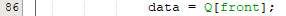

# Jawaban pertanyaan

## Nama : Auzan Ihtifazhuddin/1941720110/TI-1F

1. Atribut Q untuk menyimpan data queue dalam bentuk array 1 dimensi

2. Max = digunakan untuk atribut pendeklarasian jumlah data maksimal yang dapat disimpan di dalam queue. 
Size = digunakan sebagai atribut pendeklarasian jumlah data yang sudah masuk dalam queue Front = digunakan sebagai atribut pendeklarasian indeks data yang paling depan dalam queue.
 Rear = digunakan sebagai atribut pendeklarasian indeks data yang paling belakang dalam queue

 3. Atribut front dan rear diinisialisasi dengan nilai -1 bukannya 0, karena data disimpan menggunakan tipe data array, yang dimana array selalu diawali dari indeks 0, ketika array kosong maka seharusnya indeksnya masih belum ada, bukannya 0.
 4. Yang terjadi adalah data maksimal yang dapat dimasukkan dalam queue berkurang 1 dari yang dideklarasikan di awal. Misalnya maksimal data queue = 4, maka queue hanya dapat menyimpan sebanyak 4-1 = 3 data.
5. Untuk memeriksa rear sebelumnya, karena dalam queue, ketika data pada indeks ke 0 dikeluarkan, maka data baru akan dimasukkan ke dalam indeks 0, dan apakah rear sebelumnya berada pada posisi terakhir dalam indeks array, jika ya maka rear diubah ke indeks 0, dimana data tersebut adalah data yang baru
6. 
7. Karena method Dequeue() memerlukan nilai kembalian, yaitu data yang dikeluarkan dari queue, dan pada main ditampilkan data tersebut
8. 
9. Untuk memeriksa front sebelumnya, karena dalam queue, ketika data pada indeks ke 0 dikeluarkan, maka data baru akan dimasukkan ke dalam indeks 0, dan apakah front sebelumnya berada pada posisi terakhir dalam indeks array, jika ya maka front diubah ke indeks 0, dimana data tersebut adalah data yang baru.

10. Pada baris kode ke

11. Dikarenakan data yang masuk dalam queue tidak terurut sesuai indeks arraynya, misalkan array sudah penuh dan perlu didequeue, maka data paling awal dan berada di indeks 0 adalah data yang dikeluarkan, dan setelah itu dienqueue lagi, maka data yang baru masuk akan diletakkan di indeks array 0, sehingga tidak mungkin data yang baru masuk akan didequeue selanjutnya. Jika variabel i selalu 0 maka front akan selalu di indeks ke 0

12. Potongan kode tersebut digunakan untuk mencari nilai i, yang dimana i merupakan indeks dari urutan queue

12. Potongan kode program :

