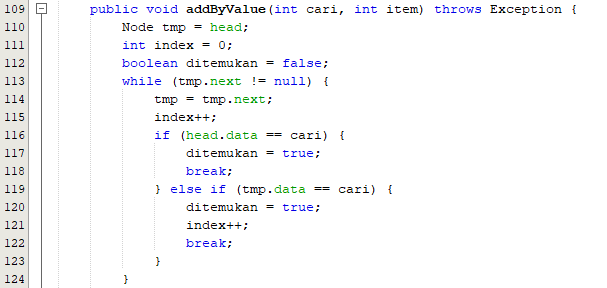
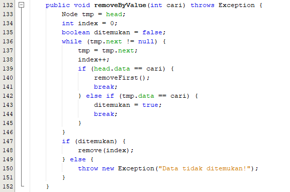

# Jawaban Pertanyaan

## Nama : Auzan Ihtifazhuddin/1941720110/TI-1F

1. Proses traverse nilai head perlu disimpan dulu dalam variabel tmp, karena digunakan sebagai variabel bantuan, dimana variabel ini berfungsi untuk mengunjungi setiap data satu persatu pada linked list dan memeriksanya, jika data tersebut tidak bernilai null, maka data akan dicetak setelah itu variabel tmp diubah menjadi data yang diambil dari head.next yaitu data selanjutnya.
2. Kekurangan dari penggunaan linked list tanpa tail adalah diperlukan perulangan menggunakan variabel bantuan untuk menambahkan data baru pada akhir linked list, sedangkan apabila menggunakan tail, maka data yang baru akan langsung ditaruh pada urutan yang paling belakang.
3. Pada project StrukturData_11, package praktikum, class LinkedLists_Modifikasi.java dan MainLinkedLists_Modifikasi.java

4. 
 

5. Hasil modifikasi ada pada project StrukturData_11, package Praktikum, class LinkedLists_Modifikasi.java dan MainLinkedLists_Modifikasi.java