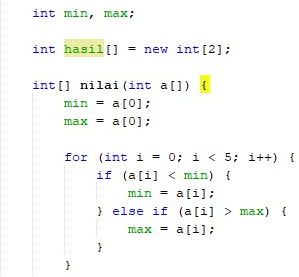

# Laporan Praktikum Brute Force Divide Conquer

1. Hasil Run

2. Maksud dari program tersebut untuk menginstansiasi array of object ppArray   Dimana :  minMax[] ppArray = new minMax[5] -> sebagai instansiasi  ppArray[0] = new minMax(); -> sebagai inisialisasi atau memberikan nilai kepada object 
3. 

 4. Bahwa nilai 4 adalah indeks akhir atau batas dari array yang diinputkan oleh user. 
 5. Karna menggunakan algoritma divide and conquer dimana array akan di bagi menjadi beberapa bagian, untuk pembagian yang sama antara bagian kanan dan bagian kiri maka memerlukan indeks awal yang merupakan indeks ke-0, indeks akhir merupakan indeks ke-n, dan indeks tengah merupakan batas diantara keduanya
 6. Karena merupakan class tersendiri, dimana deklarasi class tidak boleh dilakukan di dalam class lain. 
 7. Tidak bisa, karena nilai array pada array objek digunakan sebagai parameter
 8. Bisa Langsung memasukkan nilaiArray ke parameter pertama, dengan mengubah objek nilaiArray ke array biasa di main 
 9. Bonus
 10. Lebih baik dari segi kecepatan memecah masalah adalah divide and conquer,sedangkan Brute force lebih baik untuk yang ingin simpel dalam pengkodeannya 
 11.  Itu dinamakan ternary operation, : adalah sebagai else  Dimana penjelasanya : 
Tanda “ : “ berarti pembanding/pembatas antara kondisi jika benar dengan kondisi jika salah  Jika a>b ? maka c(jika benar) : d(jika salah) 
12. Tanda ? merupakan bagian dari operator ternary, yang sama seperti simbolnya menanyakan kondisi