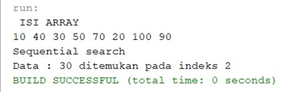
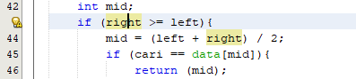
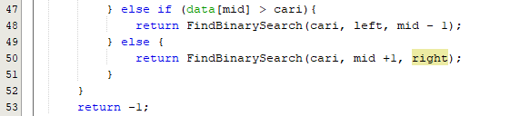
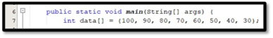
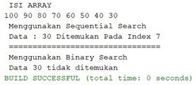
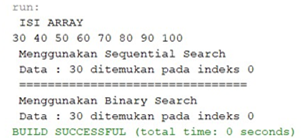
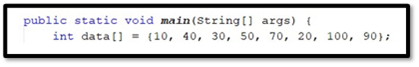
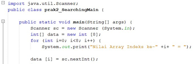
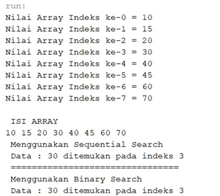

# Laporan Jobsheet 7 (Searching)

### Nama    : Auzan Ihtifazhuddin
### NIM     : 1941720110
### Kelas   : TI-1F

## Jawab Pertanyaan
### 1.4.1
1. Fungsi kode program tersebut untuk membuat method pencarian data lalu  membandingkan data yang dicari dengan data ke-I sampai n.Jika ada data yang sama dengan data yang dicari maka cetak pesan ditemukan, namun jika tidak ada data yang sama dengan data yang dicari cetak pesan tidak ditemukan. 

2. Fungsi break pada kode program diatas adalah jika digunakan untuk ‘menghentikan paksa’ proses perulangan yang berlangsung. break adalah perintah untuk mengakhiri statement. Apabila tidak ada break, komputer akan mengeksekusi intruksi yang berada di bawahnya walaupun berada di case yang berbeda.

3. 

Program masih tetap berjalan dan mempunyai hasil yang benar karena jumlah data masih sama dengan 8 dan nilianya terdapat pada data array.

### 1.4.2
1. 

2. 

3.  

Hasil tidak sesuai

supaya hasil yang sesuai maka data dirubah menjadi

Int data [] ={30,40,50,60,70,80,90,100}. 
Hasilnya :

4. 

Program tetap bisa di jalankan. Tetapi hasil dari kode Binary Search tidak sesuai dengan kode program. Alasannya karena data belum diurutkan dengan metode Merge Sort, sehingga pencarian data tidak dapat dilakukan.

5. 

Hasilnya :

