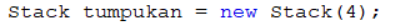
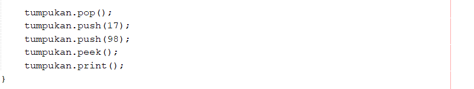
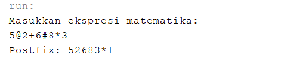

## Jawaban Pertanyaan 8.3.3 Praktikum 1

1. 

Angka 4 pada kode program tersebut adalah memberi nilai pada parameter int size milik konstruktor Stack yang berada pada kelas Stack 

2. Menambahkan data angka 17 dan 98

Hasil RUn :

3. Pada soal nomer 2,data dapat dimasukkan ke dalam stack hanya angka 17 sedangkan angka 98 tidak bisa dimasukkan karena ukuran stacknya hanya 4 dan sebelumnya stack sudah terisi 3 data jadi hanya satu data yang bisa dimasukkan lagi yaitu data angka 17 sedangkan data angka 98 tidak bisa dimasukkan karena stack sudah penuh.
4. Modifikasi program sehingga pengguna dapat memasukkan data melalui keyboard dan membentuk menu program berada pada project netbeans StrukturData package minggu8 nama file ModifStack.java dan ModifStackMain.java
5. Pada konstruktor Stack variabel top diinisialisasi dengan nilai -1 karena array dimulai dari 0, yang berarti bahwa data stack dalam keadaan kosong

## Jawaban Pertanyaan 8.4.3 Prak. 2

1. Fungsi dari method precedence adalah memberikan nilai derajat yang bertipe integer untuk setiap operator sesuai dengan urutan derajatnya agar memudahkan saat mengkonversi dari notasi infix ke notasi postfix.
2. Hasil konversi infix ke postfix.

3. Tanda kurung tidak ditampilkan pada hasil konversi karena tanda kurung tidak menentukan hasil operasi postfix, tetapi hanya membantu memberikan ketentuan saat melakukan konversi. Ketentuannya yaitu jika menemukan tanda kurung buka "(" maka push ke stack, lalu jika menemukan tanda kurung tutup ")" maka pop semua isi stack sampai ditemukan tanda kurung buka "(", kemudian tambahkan ke postfix, sedangkan tanda kurung tidak dimasukkan ke postfix oleh karena itu pada hasil konversi tanda kurung tidak ditampilkan karena tanda kurung tidak dimasukkan ke postfix.
4. Memasukkan operator @ dan # 

Operator @ dan # tidak dieksekusi dan tidak ditampilkan pada hasil konversi karena operator @ dan # tidak ada dalam method IsOperator maupun method IsOperand, maka dari itu dapat diketahui bahwa tanda @ dan # bukanlah operator maupun operand sehingga tidak di tambahkan ke postfix dan juga tidak di push ke stack 