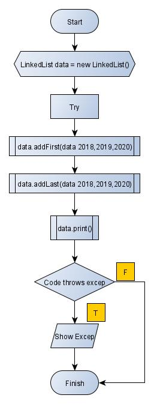
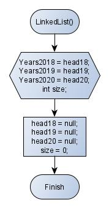
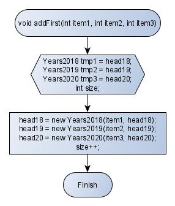
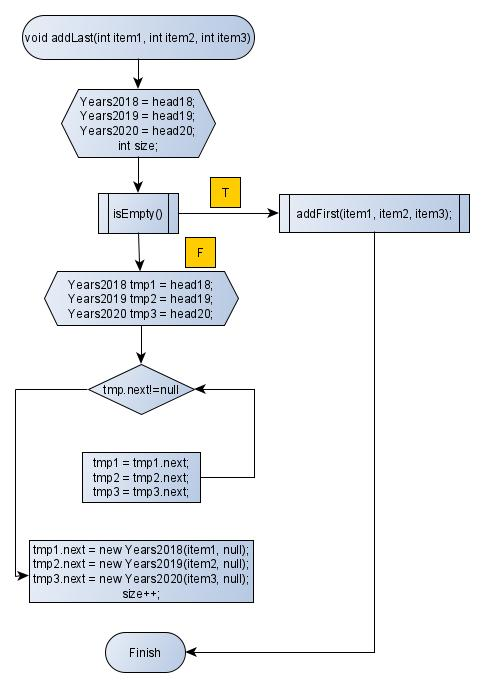
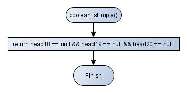
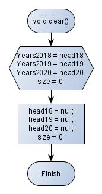
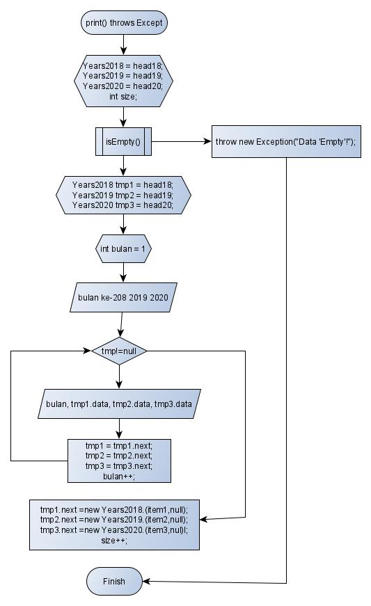

# Laporan Quiz 2

## Nama : Auzan Ihtifazhuddin
## NIM : 1941720110
## Kelas : TI-1F

1. Source Code LinkedList

2. Source Code Main

3. Source Code Years

# Penjelasan
Pada program saya, saya menggunakan class main, linkedList, dan class untuk menyimpan node per tahun. Pada class main diinputkan data secara statis sesuai data yang diberikan di soal,

Menggunakan method addFirst untuk mengisi data pertama, pada LinkedLists data pertama disebut head, sehingga data yang baru langsung dimasukkan ke head.
Untuk memasukkan data selanjutnya, digunakan method addLast, yaitu memasukkan data ke node next, dilakukan pengecekan, apabila linkedlist sedang kosong, maka dipanggil method addFirst, jika tidak, maka semua data dilakukan proses traverse lalu data yang baru diinputkan diakhir perulangan traverse.
Print data, menggunakan teknik traverse juga, yaitu data akan disimpan sementara pada variabel tertentu lalu ditampilkan, dan variabel tersebut akan diganti dengan node next nya lalu isi variabel tersebut adalah data baru yang akan ditampilkan lagi, terus berulang seperti itu hingga variabel bernilai null atau tidak ada data lagi yang bisa ditampilkan.

1. Main

2. Linked

3.AddFirst
 

4. AddLast

5. isEmpty

6. Clear

7. Print
