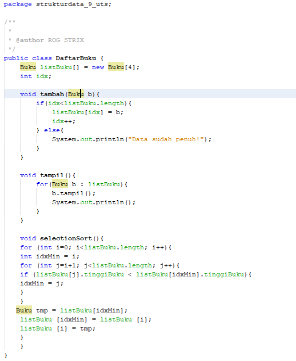

# Laporan Ujian Tengah Semester

## Nama : Auzan Ihtifazhuddin/TI-1F/1941720110

### Source Code

Seorang pustakawan hendak mengurutkan buku di dalam almari secara berurutan dari terpendek-tertipis hingga tertinggi-tertebal secara vertikal (berdiri).Jumlah halaman menggunakan bubble sort untuk pengurutan dan binary search untuk pencarian 